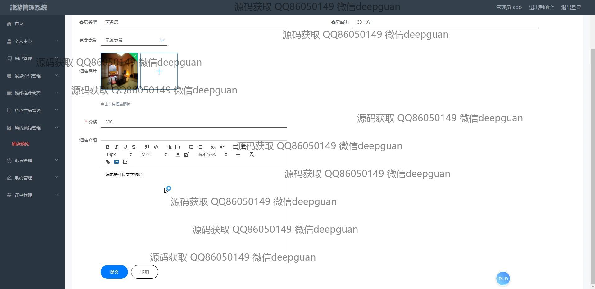
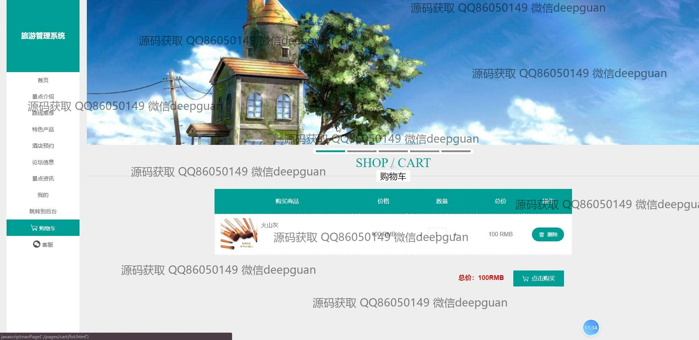

<h1 align="center">旅游系统vue左右分栏</h1>

## 简介
旅游管理系统：角色分为管理员、用户；主要功能包括景点介绍管理、路线推荐、特色产品预订、酒店预约、订单管理、用户评价及互动功能，提升用户体验与操作便捷性。    --计算机毕业设计源码；毕设源码；java毕业设计源码

## 联系方式

<h3 align="center">获取完整代码与数据库文件 + 微信：deepguan QQ: 86050149 QQ群: 783742310</h3>

<h3 align="center">可帮忙远程部署 包运行成功！提供远程部署、修改代码、设计文档指导、代码讲解等服务！</h3>

## 功能介绍（完整见运行截图）
管理员：登录、注册和退出功能，提供通过主导航栏管理的多项功能模块，包括景点管理、路线推荐、特色产品管理、酒店预约管理、以及订单和客服的管理功能。此外，管理员还可以进行用户管理，查看和编辑用户信息，管理景点及线路详情，包括图片上传和格式化文本编辑等，提高操作流程和用户体验。管理员可通过后台界面高效管理和维护旅游系统数据，实现各项信息的集中更新。

用户：基本功能包括登录和注册，并拥有个人中心以查看和编辑个人信息，如用户名、联系方式和个人资料。用户可以进行酒店预约以及通过购物车和支付功能完成订单操作，浏览和选择特色产品、路线推荐等，支持用户评论与评分，以丰富互动体验。同时，用户还能够查看周边景点信息及旅游产品，参与论坛讨论，以便捷方式完成旅游相关的操作和管理业务。

## 运行截图

本代码来源于网络,仅供学习参考使用!

